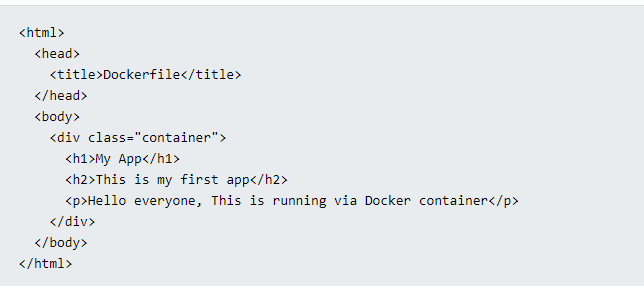
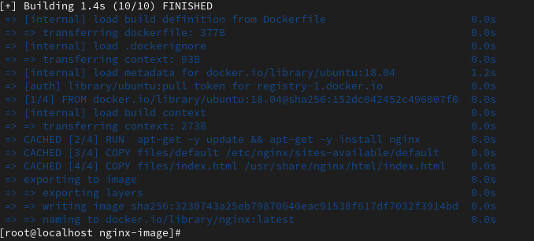
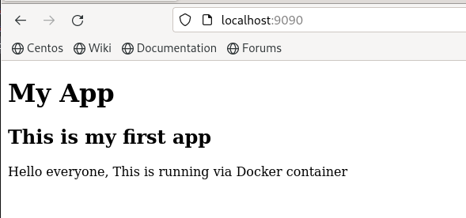

### **How to create a dockerfile from scratch**

## Step 1.
 Create a folder named nginx-image & create a folder named files
     
       mkdir nginx-image && cd nginx-image
       mkdir files

       Create a .dockerignore file
     
       touch .dockerignore

## Step 2 
 Create a sample HTML file & Config file

For demo purposes, we will create a simple HTML file & config file as our app code and package it using Docker. This is a simple index.html file. You can create your own if you want.

cd in to the files folder
   
    cd files
create an index.html file

    vi index.html

copy the following content into the index.html and save the file.

create a file name default
   
    vi default

copy the following content to the default file

 

 ## Step 3
Choose a Base Image

The FROM command in the Dockerfile tells Docker to build an image based on other images that are already present on the Docker hub or any other container registry that has been set up using Docker. It's a base image, as we say.

Our preferred application and OS platform will determine the base image we choose. In this instance, we'll select the Ubuntu:18.04 base image.

##   Create a Dockerfile in the nginx-image folder.

   
    vi Dockerfile

## Step 4
Build your first Docker Image

The final folder & file structure would look like the following.

Now, we will build our image using the Docker command. The below command will build the image using Dockerfile from the same directory
 
    docker build -t nginx:latest .

-t is for tagging the image.

nginx is the name of the image.

latest is the tag name. 

If you don’t add any tag, it defaults to the tag named latest.

. means, we are referring to the Dockerfile location as the docker build context.

Note - If the Dockerfile is in another folder then you need to specify it explicitly.

    docker build -t nginx /path/to/folder 

Now, we can list the images by using this command.

    docker images

   

 
 
## Step 5: Test the Docker Image

Now after building the image we will run the Docker image. The command will be

    docker run -d -p 9090:80 --name webserver nginx:latest

Here,

-d flag is for running the container in detached mode

-p flag for the port number, the format is local-port:container-port

--name for the container name, webserver in our case

### We can check the container by using the below command
     docker ps 

   
 

 Now in the browser, if you go to http://localhost:9090  you can see the index page which displays the content in the custom HTML page we added to the docker image.

 

### Now we can push our Docker Image to Docker Hub
    docker login

After login, we now need to tag our image with the docker username as shown below.

    docker tag nginx:2.0 < docker username >/< image-name >:tag

Run docker images command again and check the tagged image will be there.

## Step 7
Now we can push our images to the Docker hub using the below command.

    docker push samuel78996/nginx:2.0 

    

 [For more check here ](https://devopscube.com/build-docker-image/)